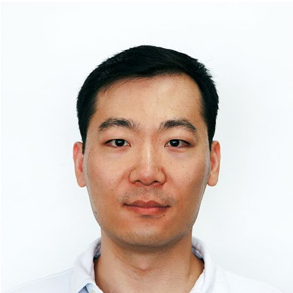
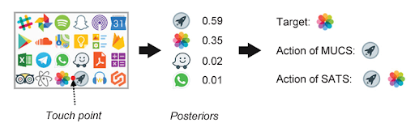
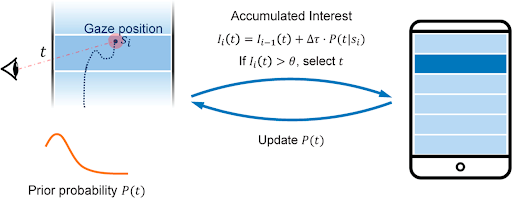
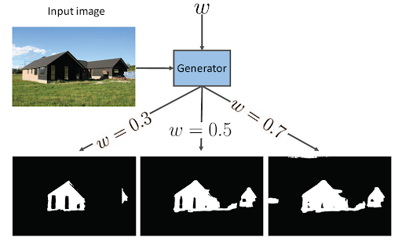

# Andrew (Maozheng) Zhao [Resume](Resume_Andrew.pdf)
[Resume](Resume_Andrew.pdf) \|
[LinkedIn](https://www.linkedin.com/in/andrew-maozheng-z-51079914a/) \|
[Google scholar](https://scholar.google.com/citations?hl=en&user=3wbgHbIAAAAJ)
 

## About me
  

I completed my Ph.D. in Computer Science, advised by Prof. [Xiaojun Bi](https://www3.cs.stonybrook.edu/~xiaojun/) in the Human-computer Interaction Lab at [Stony Brook University](https://www.stonybrook.edu/). My research focuses on intelligent multimodal input technologies on mobile devices. I integrated multiple input modalities, such as touch, voice, and eye gaze, with AI models for a more efficient and natural interaction experience. I’m experienced with Android, iOS, and Unity development, as well as LLM finetuning and computer vision.
   

## Internship experience

**Research Scientist Intern, Meta, Redmond, WA** 
May 2022 - Sept 2022 
Built a multi-modal gesture input application in virtual reality using wristband and eye gaze as input. It reduced 30% movement burden for users. The project is published in IUI 2023.  
 
**Research Intern, Google, Mountain View, CA** 
Oct 2022 - Dec 2022 
Fine-tuned LLMs to enable Android settings search to understand natural language queries. The fine-tuned LLMs outperform traditional search methods such as TF-IDF, sentence encoding, and prompt engineering. 
 
**Student researcher, Google, Mountain View, CA** 
Dec, 2022 - May, 2023  

## Selected publications

  

### LLM-VT: LLM-based Noise-robust Case-sensitive Text Correction System on Smartphones with Voice and Touch Input  
**Maozheng Zhao**, Nathan Huang, Rui Liu, Michael Xuelin Huang, Shumin Zhai, I. V. Ramakrishnan, and Xiaojun Bi  
Submitted to Proceedings of the ACM on Interactive, Mobile, Wearable and Ubiquitous Technologies (**IMWUT**), 2024  
[Webpage](https://maozheng6.github.io/LLM-VT/)

#

<a href="https://maozheng6.github.io/VT/">  
### Voice and Touch Based Error-tolerant Multimodal Text Editing and Correction for Smartphones
**Maozheng Zhao**, Wenzhe Cui, I. V. Ramakrishnan, Shumin Zhai, and Xiaojun Bi  
ACM Symposium on User Interface Software and Technology (**UIST**), 2021. [Acceptance Rate: 25.05%]   
[Webpage](https://maozheng6.github.io/VT/), <a href="https://dl.acm.org/doi/pdf/10.1145/3472749.3474742">  [Paper](https://dl.acm.org/doi/pdf/10.1145/3472749.3474742)  
#

<a href="https://maozheng6.github.io/GazeSpeedup/">  
### Gaze Speedup: Eye Gaze Assisted Gesture Typing in Virtual Reality
**Maozheng Zhao**, Alec M. Pierce, Ran Tan, Ting Zhang, Tianyi Wang, Tanya R. Jonker, Hrvoje Benko, and Aakar Gupta.  
International Conference on Intelligent User Interfaces (**IUI**), 2023. [Acceptance Rate: 24.1%]   
[Project webpage](https://maozheng6.github.io/GazeSpeedup/), <a href="https://dl.acm.org/doi/pdf/10.1145/3581641.3584072">  [Paper](https://dl.acm.org/doi/pdf/10.1145/3581641.3584072)  
#

<a href="https://maozheng6.github.io/EyeSayCorrect/">  

### EyeSayCorrect: Eye Gaze and Voice Based Hands-free Text Correction for Mobile Devices
**Maozheng Zhao**, Henry Huang, Zhi Li, Rui Liu, Wenzhe Cui, Kajal Toshniwal, Ananya Goel, et al.    
International Conference on Intelligent User Interfaces (**IUI**), 2022. [Acceptance Rate: 24.5%]    
[Project webpage](https://maozheng6.github.io/EyeSayCorrect/), <a href="https://dl.acm.org/doi/pdf/10.1145/3490099.3511103">  [Paper](https://dl.acm.org/doi/pdf/10.1145/3490099.3511103)  
#

  

### Select or Suggest? Reinforcement Learning-based Method for High-Accuracy Target Selection on Touchscreens
Li, Zhi, **Maozheng Zhao**, Dibyendu Das, Hang Zhao, Yan Ma, Wanyu Liu, Michel Beaudouin-Lafon, Fusheng Wang, Iv Ramakrishnan, and Xiaojun Bi.   
Conference on Human Factors in Computing Systems (**CHI**), 2022. [Acceptance Rate: 24.8%]   
<a href="https://maozheng6.github.io/Maozheng/SOS.pdf">  [Paper](https://maozheng6.github.io/Maozheng/SOS.pdf)  
#

  

### BayesGaze: A Bayesian Approach to Eye-Gaze Based Target Selection
Li, Zhi, **Maozheng Zhao**, Yifan Wang, Sina Rashidian, Furqan Baig, Rui Liu, Wanyu Liu et al.  
Graphics Interface (**GI**), 2021.  
<a href="https://www.ncbi.nlm.nih.gov/pmc/articles/PMC8853835/">  [Paper](https://www.ncbi.nlm.nih.gov/pmc/articles/PMC8853835/)  
#

  

### Shadow detection with conditional generative adversarial networks
Nguyen, Vu, Tomas F. Yago Vicente, **Maozheng Zhao**, Minh Hoai, and Dimitris Samaras.  
IEEE International Conference on Computer Vision (**ICCV**), 2017.  
<a href="https://maozheng6.github.io/Maozheng/scgan.pdf">  [Paper](https://maozheng6.github.io/Maozheng/scgan.pdf)   
#

## Programming skills
Python, Java, Swift, C#, C++, PyTorch, TensorFlow, iOS development, Android development, Unity development

