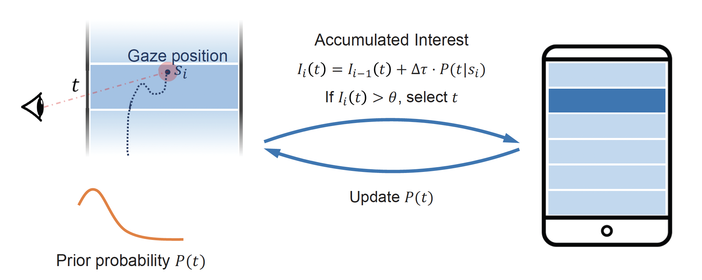
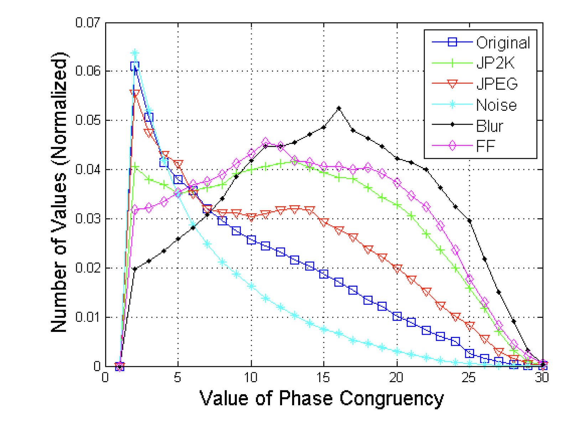

# Maozheng Zhao
PhD student in Human-computer Interaction 
Stony Brook University 
Stony Brook, New York, United States 
Email: maozheng.zhao@stonybrook.edu 

My research focuses on multi-modal human-computer interaction, specifically combining modalities such as touch, voice, eye gaze with AI and deep learning models for a more natural and efficient interaction experience.

[CV (pdf)](cv.pdf) | [LinkedIn](https://www.linkedin.com/in/maozheng-zhao-51079914a/) | [Google scholar](https://scholar.google.com/citations?hl=en&user=3wbgHbIAAAAJ)

### Selected publications

[1]. **Maozheng Zhao**, Wenzhe Cui, IV Ramakrishnan, Shumin Zhai, Xiaojun Bi (2021) "Voice and Touch Based Error-tolerant Multimodal Text Editing and Correction for Smartphones". In Proceedings of UIST 2021 - The ACM Symposium on User Interface Software and Technology. 17 pages. Accepted. [Acceptance Rate: 25.9%].  [Paper](VT.pdf), [Project page](https://maozheng6.github.io/VT/).

 

[2]. **Maozheng Zhao**, Henry Huang, Zhi Li, Rui Liu, Wenzhe Cui, Kajal Toshniwal, Ananya Goel, Andrew Wang, Xia Zhao, Sina Rashidian, Furqan Baig, Khiem Phi, Shumin Zhai, I.V. Ramakrishnan, Fusheng Wang, and Xiaojun Bi. EyeSayCorrect: Eye Gaze and Voice Based Hands-free Text Correction for Mobile Devices. In The 27th ACM Annual Conference on Intelligent User Interfaces (IUI '22), March 22-25, 2022, Virtual Event, Helsinki, Finland, 14 pages. Accepted. [Acceptance Rate: 24.5%]. [Paper](EyeSayCorrect_camera_ready.pdf), [Project page](https://maozheng6.github.io/EyeSayCorrect/).

 

[3] Li, Zhi, **Maozheng Zhao**, Yifan Wang, Sina Rashidian, Furqan Baig, Rui Liu, Wanyu Liu et al. "BayesGaze:
A Bayesian Approach to Eye-Gaze Based Target Selection." In Graphics Interface 2021. 2021.  [Paper](bayesgaze.pdf)

 

[4] Zhao, Maozheng, Qin Tu, Yanping Lu, Yongyu Chang, and Bo Yang. "No-reference image quality assessment based on phase congruency and spectral entropies." In 2015 Picture Coding Symposium (PCS), pp.302-306. IEEE, 2015. [Paper](PCSEQ.pdf)

### Skills
Android development with Java, iOS development with Swift, Deep learning tools Pytorch and TensorFlow

### Teaching Experience
Teaching Assistance for CSE323 human-computer interaction, CSE214 data structures and CSE215 foundations of computer science

