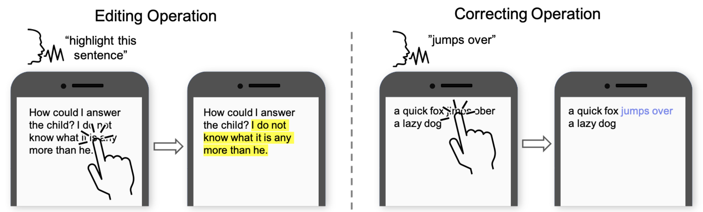
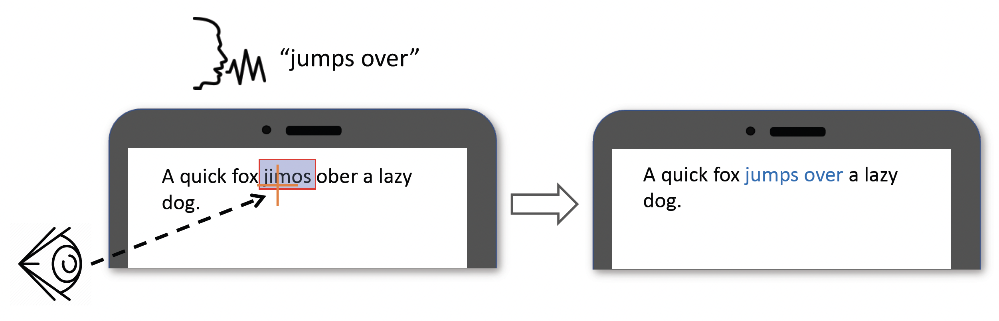

# Maozheng Zhao
PhD student in Human-computer Interaction 
Stony Brook University 
Stony Brook, New York, United States 
Email: maozheng.zhao@stonybrook.edu 

## About
My research focuses on multi-modal human-computer interaction, specifically combining modalities such as touch, voice, eye gaze with AI and deep learning models for a more natural and efficient interaction experience.

[Curriculum Vitae](cv.pdf) | [LinkedIn](https://www.linkedin.com/in/maozheng-zhao-51079914a/) | [Google scholar](https://scholar.google.com/citations?hl=en&user=3wbgHbIAAAAJ)

## Selected publications

[1]. **Maozheng Zhao**, Wenzhe Cui, IV Ramakrishnan, Shumin Zhai, Xiaojun Bi (2021) "Voice and Touch Based Error-tolerant Multimodal Text Editing and Correction for Smartphones". In Proceedings of UIST 2021 - The ACM Symposium on User Interface Software and Technology. 17 pages. Accepted. [Acceptance Rate: 25.9%]. [Project page](https://maozheng6.github.io/VT/), [Paper](VT.pdf).
[1]. **Maozheng Zhao**, Wenzhe Cui, IV Ramakrishnan, Shumin Zhai, Xiaojun Bi (2021) "Voice and Touch Based Error-tolerant Multimodal Text Editing and Correction for Smartphones". In Proceedings of UIST 2021 - The ACM Symposium on User Interface Software and Technology. 17 pages. Accepted. [Acceptance Rate: 25.9%]

 

[2]. **Maozheng Zhao**, Henry Huang, Zhi Li, Rui Liu, Wenzhe Cui, Kajal Toshniwal, Ananya Goel, Andrew Wang, Xia Zhao, Sina Rashidian, Furqan Baig, Khiem Phi, Shumin Zhai, I.V. Ramakrishnan, Fusheng Wang, and Xiaojun Bi. EyeSayCorrect: Eye Gaze and Voice Based Hands-free Text Correction for Mobile Devices. In The 27th ACM Annual Conference on Intelligent User Interfaces (IUI '22), March 22-25, 2022, Virtual Event, Helsinki, Finland, 14 pages. Accepted. [Acceptance Rate: 24.5%] [Project page](https://maozheng6.github.io/EyeSayCorrect/),[Paper](EyeSayCorrect_camera_ready.pdf).

