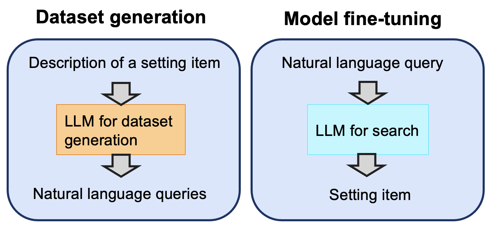

  
# Andrew (Maozheng) Zhao
Computer Science PhD at Stony Brook University  
Email: andrew.zhao.2024@gmail.com 
Phone：(631)-428-3846 
[Resume](Resume_Andrew.pdf) \|
[LinkedIn](https://www.linkedin.com/in/andrew-maozheng-z-51079914a/) \|
[Google scholar](https://scholar.google.com/citations?hl=en&user=3wbgHbIAAAAJ)

## Introduction

My research focuses on intelligent multimodal input technologies on mobile devices. I published in UIST, CHI, and IUI. I've built input technologies with touch, voice, and eye gaze in Android, iOS, and Unity. I also have experience with LLM finetuning and computer vision.

## Education

**Ph.D., Stony Brook University, USA** 
Major: Computer Science.  Advisor: Prof. Xiaojun Bi.  GPA: 3.78  
Graduated in Dec 2023. 

**M.S., Beijing University of Posts and Telecommunications, China** 
Major: Information and Communication Engineering.  GPA: 3.80 

**B.S., Harbin Engineering University, China** 
Major: Electronic and Information Engineering. GPA: 3.82 

## Internship experience

**Research Scientist Intern, Meta, Redmond, WA** 
May 2022 - Sept 2022 
Built a multi-modal gesture input application in virtual reality using wristband and eye gaze as input. It reduced 30% movement burden for users. The project is published in IUI 2023.  
 
**Research Intern, Google, Mountain View, CA** 
Oct 2022 - Dec 2022 
Fine-tuned LLMs to enable Android settings search to understand natural language queries. The fine-tuned LLMs outperform traditional search methods such as TF-IDF, sentence encoding, and prompt engineering. 
 
**Student researcher, Google, Mountain View, CA** 
Dec, 2022 - May, 2023  

## Selected publications

#### IMWUT 2024 (under submission)
**Zhao, Maozheng**, Nathan Huang, Rui Liu, Michael Xuelin Huang, Shumin Zhai, I. V. Ramakrishnan, and Xiaojun Bi. “LLM-VT: LLM-based Noise-robust Case-sensitive Text Correction System on Smartphones with Voice and Touch Input”. Submitted to Proceedings of the ACM on Interactive, Mobile, Wearable and Ubiquitous Technologies (IMWUT 2024).  
[Webpage](https://maozheng6.github.io/LLM-VT/)

#### UIST 2021
**Zhao, Maozheng**, Wenzhe Cui, I. V. Ramakrishnan, Shumin Zhai, and Xiaojun Bi. "Voice and Touch Based Error-tolerant Multimodal Text Editing and Correction for Smartphones." In The 34th Annual ACM Symposium on User Interface Software and Technology (UIST 2021), pp. 162-178. 2021. [Acceptance Rate: 25.05%]  
[Webpage](https://maozheng6.github.io/VT/), <a href="https://dl.acm.org/doi/pdf/10.1145/3472749.3474742">  [Paper](https://dl.acm.org/doi/pdf/10.1145/3472749.3474742)  

#### IUI 2023
**Zhao, Maozheng**, Alec M. Pierce, Ran Tan, Ting Zhang, Tianyi Wang, Tanya R. Jonker, Hrvoje Benko, and Aakar Gupta. "Gaze Speedup: Eye Gaze Assisted Gesture Typing in Virtual Reality." In Proceedings of the 28th International Conference on Intelligent User Interfaces (IUI 2023), pp. 595-606. 2023. [Acceptance Rate: 24.1%]  
[Webpage](https://maozheng6.github.io/GazeSpeedup/), <a href="https://dl.acm.org/doi/pdf/10.1145/3581641.3584072">  [Paper](https://dl.acm.org/doi/pdf/10.1145/3581641.3584072)  

#### IUI 2022
**Zhao, Maozheng**, Henry Huang, Zhi Li, Rui Liu, Wenzhe Cui, Kajal Toshniwal, Ananya Goel et al. "EyeSayCorrect: Eye Gaze and Voice Based Hands-free Text Correction for Mobile Devices." In 27th International Conference on Intelligent User Interfaces (IUI 2022), pp. 470-482. 2022. [Acceptance Rate: 24.5%]  
[Webpage](https://maozheng6.github.io/EyeSayCorrect/), <a href="https://dl.acm.org/doi/pdf/10.1145/3490099.3511103">  [Paper](https://dl.acm.org/doi/pdf/10.1145/3490099.3511103)  

#### CHI 2022
Li, Zhi, **Maozheng Zhao**, Dibyendu Das, Hang Zhao, Yan Ma, Wanyu Liu, Michel Beaudouin-Lafon, Fusheng Wang, Iv Ramakrishnan, and Xiaojun Bi. "Select or Suggest? Reinforcement Learning-based Method for High-Accuracy Target Selection on Touchscreens." In CHI Conference on Human Factors in Computing Systems (CHI), pp. 1-15. 2022. [Acceptance Rate: 24.8%] 
 <a href="https://maozheng6.github.io/Maozheng/SOS.pdf">  [Paper](https://maozheng6.github.io/Maozheng/SOS.pdf)  

#### GI 2021
Li, Zhi, **Maozheng Zhao**, Yifan Wang, Sina Rashidian, Furqan Baig, Rui Liu, Wanyu Liu et al. "BayesGaze: A Bayesian Approach to Eye-Gaze Based Target Selection." In Proceedings. Graphics Interface (GI), vol. 2021, p. 231. NIH Public Access, 2021. 
 <a href="https://www.ncbi.nlm.nih.gov/pmc/articles/PMC8853835/">  [Paper](https://www.ncbi.nlm.nih.gov/pmc/articles/PMC8853835/)  

#### ICCV 2017

Nguyen, Vu, Tomas F. Yago Vicente, **Maozheng Zhao**, Minh Hoai, and Dimitris Samaras. "Shadow detection with conditional generative adversarial networks." In Proceedings of the IEEE International Conference on Computer Vision (ICCV), pp. 4510-4518. 2017.  
<a href="https://maozheng6.github.io/Maozheng/scgan.pdf">  [Paper](https://maozheng6.github.io/Maozheng/scgan.pdf)  

#### PCS 2015
**Zhao, Maozheng**, Qin Tu, Yanping Lu, Yongyu Chang, and Bo Yang. "No-reference image quality assessment based on phase congruency and spectral entropies." In 2015 Picture Coding Symposium (PCS), pp. 302-306. IEEE, 2015. 
<a href="https://maozheng6.github.io/Maozheng/iqa.pdf">  [Paper](https://maozheng6.github.io/Maozheng/iqa.pdf)  

## Project experience

  

### LLM-based text correction with voice and touch input on smartphones

Developed an end-to-end Android APP for a new LLM-based text correction method with voice and touch input. Fine-tuned LLM on Google colab with a semi-synthetic dataset. Served the LLM on a cloud server that communicates with the Android APP for text correction. Carried out a user study and proved that the proposed LLM-based method reduced 15% text correction time from the state-of-the-art method.  

 

<a href="https://maozheng6.github.io/VT/">  

### Voice and Touch Based Error-tolerant Multimodal Text Editing and Correction for Smartphones

[Project webpage](https://maozheng6.github.io/VT/), <a href="https://dl.acm.org/doi/pdf/10.1145/3472749.3474742">  [Paper](https://dl.acm.org/doi/pdf/10.1145/3472749.3474742)  

Developed an end-to-end Android APP for a new text correction and text formatting method with voice and touch input. Converted voice input to executable text correction or formatting commands. Implemented a 3-gram language model and word embedding model on Android phones to correct text. Carried out a user study which proved that the proposed method reduced 31% text editing time and 48% text correction time from the iOS Voice Control.  

 

<a href="https://maozheng6.github.io/EyeSayCorrect/">  

### EyeSayCorrect: Eye Gaze and Voice Based Hands-free Text Correction for Mobile Devices

[Project webpage](https://maozheng6.github.io/EyeSayCorrect/), <a href="https://dl.acm.org/doi/pdf/10.1145/3490099.3511103">  [Paper](https://dl.acm.org/doi/pdf/10.1145/3490099.3511103)  

Developed an end-to-end iOS APP for a new text correction method with eye gaze and voice input on an iPad Pro. Proposed a new eye gaze target selection method using Beyesian theory for noisy eye gaze input. Implemented a 3-gram language model on a cloud server connected with the APP for text correction. Carried out a user study which proved that the Bayesian method reduced up to 23% text correction time from the non-Bayesian method.   

 

<a href="https://maozheng6.github.io/GazeSpeedup/">  

### (Meta internship) Gaze Speedup: Eye Gaze Assisted Gesture Typing in Virtual Reality

[Project webpage](https://maozheng6.github.io/GazeSpeedup/), <a href="https://dl.acm.org/doi/pdf/10.1145/3581641.3584072">  [Paper](https://dl.acm.org/doi/pdf/10.1145/3581641.3584072)  

Developed an end-to-end 3D Unity APP on Meta Quest 2 with C# for a new text input method with eye gaze and wristband input. Reduced 30% hand movement burden from users during swipe typing in VR by utilizing users' eye gaze. 

 

  

### (Google internship) LLM-based Android search for natural queries

Fine tuned LLMs to enable Android settings search to understand natural language queries. Created a synthetic dataset using LLMs, evaluated the fine-tuned model with real user queries. The fine-tuned model significantly outperforms other search methods such as TF-IDF, sentence encoding, and LLM prompt engineering.  

 

## Programming experience
Python, Java, Swift, C#, C++, PyTorch, TensorFlow, iOS development, Android development, Unity development

## Teaching Experience
Teaching Assistance for CSE323 human-computer interaction, CSE214 data structures and CSE215 foundations of computer science

